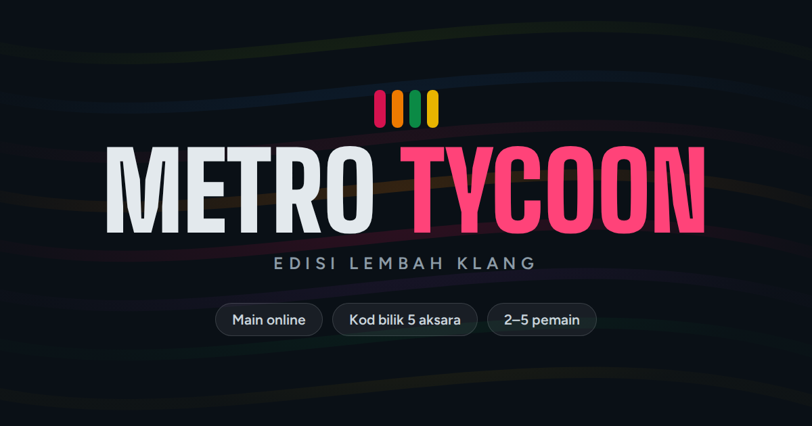

# Metro Tycoon KL 🚆



**Permainan papan hartanah bertemakan laluan rel Lembah Klang.** Beli stesen MRT, LRT, Monorel, KTM Komuter dan ERL, kutip sewa, bina rumah dan hotel, dan jadi tycoon transit terkaya di KL.

### ▶️ [Main sekarang](https://farezbaharom-cmyk.github.io/metro-tycoon/)

Tiada muat turun atau pendaftaran diperlukan. Buka di pelayar telefon atau komputer, dan terus main.

---

## Cara main

| Mod | Penerangan |
|---|---|
| **Main sekarang** | Anda lawan satu bot, terus bermula. |
| **⚡ Main cepat** | Siap dalam lebih kurang 20 minit. Setiap pemain terus dapat beberapa stesen, dan permainan tamat selepas beberapa ronde. |
| **Main dengan kawan** | Cipta bilik online dan kongsi kod 5 huruf (atau pautan jemputan). Sehingga 5 pemain, dan boleh campur dengan bot. |
| **Satu peranti** | 2 hingga 5 pemain berkongsi satu skrin. Mana-mana pemain boleh ditukar kepada bot. |

**Asas permainan**
- Baling dua dadu dan gerak. Lalu **MULA** untuk kutip RM200.
- Mendarat di stesen yang belum dimiliki: **beli**, atau lepaskan untuk **dilelong** kepada semua pemain.
- Mendarat di stesen orang lain: **bayar sewa**. Kalau pemilik ada **laluan penuh**, sewa asas jadi dua kali ganda.
- **Bina rumah dan hotel** untuk naikkan sewa.
- **Tawar-menawar** hartanah dan tunai dengan pemain lain pada bila-bila masa dalam giliran anda.
- Wang tak cukup? Jual bangunan, gadai hartanah, atau isytihar muflis.
- **Pemenang** ialah pemain yang ada kekayaan bersih tertinggi.

Peraturan penuh ada dalam permainan, di **⚙️ Menu → Peraturan**.

## Ciri-ciri

- 🗺️ **Laluan sebenar Lembah Klang:** MRT Kajang, MRT Putrajaya, LRT Kelana Jaya, LRT Ampang, LRT Sri Petaling, Monorel KL, KTM Komuter dan ERL, dengan hab KL Sentral, Masjid Jamek, Pasar Seni dan Bandar Tasik Selatan.
- 🃏 **40 kad Peluang dan Tabung bertema KL:** Grab surge, jem di Jalan Tun Razak, LRT tersadai, banjir kilat, duit raya dan angpau, teh tarik di mamak.
- 📰 **Berita rawak setiap ronde:** waktu puncak MRT, laluan ditutup, promosi tambang, pengecualian cukai dan lain-lain, dipaparkan pada jalur LED macam papan stesen sebenar.
- 🔊 **Pengumuman stesen bersuara** dengan tiga gaya, iaitu **Pakcik**, **Slay** dan **Pengulas**.
- 🎉 **Sambutan laluan penuh** dengan animasi dan pengumuman.
- 🏅 **Statistik dan lencana di skrin tamat**, contohnya Raja Sewa, Tuan Tanah, Banduan Tetap dan Bangkit Semula, dengan butang kongsi keputusan ke WhatsApp.
- 🐱 **Pilih watak** di lobi atau borang permainan: tren, atau salah satu daripada lima kucing (Oyen, Tuxedo, Putih, Kelabu, Calico). Setiap kucing hanya untuk seorang pemain, dan pilihan anda diingati untuk permainan seterusnya.
- 🤖 **Bot dua tahap**, Mudah dan Sederhana.
- ⏱️ **Had masa giliran** dalam bilik online (30, 60 atau 90 saat, atau tiada had). Jika pemain tidak bertindak atau terputus talian, bot mengambil alih giliran itu secara automatik.
- 👀 **Mod penonton**: kawan yang masuk selepas permainan bermula, atau bila bilik penuh, boleh menonton secara langsung.
- 🌃 **Langit KL** di tengah papan (Menara Berkembar, KL Tower, Merdeka 118). Ia bertukar siang atau malam ikut tema cerah atau gelap.
- 📲 **Boleh dipasang macam app** di skrin utama telefon, dan mod satu peranti boleh dimain tanpa internet.
- 💾 **Permainan disimpan automatik** dalam pelayar.

## Teknologi

- Satu fail `index.html`: HTML, CSS dan JavaScript biasa, tanpa framework dan tanpa langkah build.
- [Firebase Realtime Database](https://firebase.google.com/docs/database) untuk bilik online, dan Firebase Anonymous Auth untuk log masuk tanpa nama.
- Web Speech API untuk pengumuman bersuara.
- Service worker (`sw.js`) dan `manifest.webmanifest` untuk sokongan PWA.
- Dihoskan di GitHub Pages.

## Jalankan sendiri

1. Fork atau muat turun repo ini.
2. Buka `index.html` terus dalam pelayar. Mod satu peranti boleh dimain tanpa sebarang persediaan.
3. Untuk mod online dengan projek Firebase anda sendiri:
   - Cipta projek di [Firebase Console](https://console.firebase.google.com), dan hidupkan **Realtime Database** serta **Authentication → Anonymous**.
   - Ganti nilai dalam `FIREBASE_CONFIG` di bahagian atas skrip dalam `index.html` (`apiKey`, `authDomain`, `projectId`, `databaseURL`).
   - Tampal peraturan pangkalan data di bawah (juga ada dalam `database.rules.json`) ke tab **Rules**. Peraturan ini turut membenarkan sesiapa memadam bilik yang lebih tua daripada 48 jam dan tiada pemain dalam talian, supaya bilik terbiar tidak berlonggok.
   - (Pilihan) Hidupkan **App Check** dengan reCAPTCHA v3, isi `APPCHECK_SITE_KEY` dalam `index.html`, dan hanya selepas itu tekan **Enforce** untuk Realtime Database.

<details>
<summary>Peraturan Realtime Database</summary>

```json
{
  "rules": {
    ".read": false,
    ".write": false,
    "rooms": {
      "$code": {
        ".read": "auth != null",
        ".write": "auth != null && ((!data.exists() && newData.child('meta/host').val() === auth.uid && newData.child('seats/' + auth.uid).exists()) || (data.exists() && !newData.exists() && data.child('meta/host').val() === auth.uid) || (data.exists() && !newData.exists() && !data.child('online').exists() && data.child('meta/created').val() < now - 172800000))",
        ".validate": "$code.length === 5 && $code.matches(/^[A-Z0-9]+$/) && newData.hasChild('meta')",
        "meta": {
          ".write": "auth != null && data.child('host').val() === auth.uid && newData.child('host').val() === auth.uid",
          ".validate": "newData.hasChildren(['host', 'created', 'started'])",
          "host": { ".validate": "newData.isString()" },
          "created": { ".validate": "newData.isNumber() && (!data.exists() || newData.val() === data.val())" },
          "started": { ".validate": "newData.isBoolean()" },
          "qual": { ".validate": "newData.isNumber() && newData.val() >= 0 && newData.val() <= 3" },
          "endLaps": { ".validate": "newData.isNumber() && newData.val() >= 0 && newData.val() <= 20" },
          "cash": { ".validate": "newData.isNumber() && newData.val() >= 500 && newData.val() <= 5000" },
          "tl": { ".validate": "newData.isNumber() && newData.val() >= 0 && newData.val() <= 300" },
          "auc": { ".validate": "newData.isBoolean()" },
          "fast": { ".validate": "newData.isBoolean()" },
          "$other": { ".validate": false }
        },
        "seats": {
          "$uid": {
            ".write": "auth != null && (($uid === auth.uid && (!newData.exists() || root.child('rooms/' + $code + '/meta/started').val() !== true)) || (root.child('rooms/' + $code + '/meta/host').val() === auth.uid && $uid.beginsWith('bot_')))",
            ".validate": "newData.hasChildren(['name', 't'])",
            "name": { ".validate": "newData.isString() && newData.val().length >= 1 && newData.val().length <= 16" },
            "t": { ".validate": "newData.isNumber()" },
            "bot": { ".validate": "newData.val() === 'mudah' || newData.val() === 'sederhana'" },
            "tok": { ".validate": "newData.isString() && (newData.val() === 'tren' || newData.val().matches(/^c[0-4]$/))" },
            "$other": { ".validate": false }
          }
        },
        "online": {
          "$uid": {
            ".write": "auth != null && $uid === auth.uid",
            ".validate": "newData.hasChild('t')",
            "t": { ".validate": "newData.isNumber() && newData.val() <= now" },
            "w": { ".validate": "newData.isString() && newData.val().length <= 16" },
            "$other": { ".validate": false }
          }
        },
        "state": {
          ".write": "auth != null && root.child('rooms/' + $code + '/seats/' + auth.uid).exists()",
          ".validate": "newData.isString() && newData.val().length < 200000"
        },
        "$other": { ".validate": false }
      }
    },
    "roomIndex": {
      ".read": "auth != null && query.orderByValue == true && query.endAt <= now - 172800000 && query.limitToFirst <= 10",
      ".indexOn": ".value",
      "$code": {
        ".write": "auth != null && ((!data.exists() && root.child('rooms/' + $code + '/meta/host').val() === auth.uid) || (!newData.exists() && (!root.child('rooms/' + $code).exists() || root.child('rooms/' + $code + '/meta/host').val() === auth.uid)))",
        ".validate": "newData.isNumber() && newData.val() === root.child('rooms/' + $code + '/meta/created').val()"
      }
    }
  }
}
```

</details>

> `apiKey` Firebase dalam kod ini memang direka untuk berada dalam laman web awam, jadi ia bukan rahsia. Data dilindungi oleh peraturan pangkalan data di atas.

## Nota

Metro Tycoon KL ialah projek peminat dan tidak berkaitan dengan Prasarana, Rapid KL, MRT Corp, KTMB atau ERL. Nama stesen dan laluan digunakan untuk tema sahaja.

---

Dibina oleh **Farez** 🇲🇾
